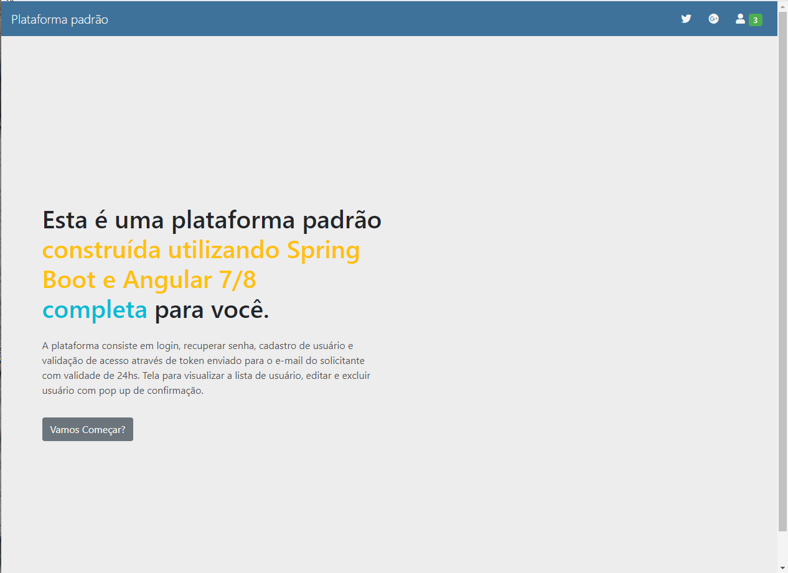

## Demo 📸

  

## Sobre o Projeto / About this project

Login, profiles and roles, password, recovering password, tokens and refresh tokens.
Layout/Template: https://mdbootstrap.com/

Backend: https://api-angular-java.herokuapp.com
         https://github.com/deivisutp/java-spring-mongo
         

### 🛠 Tecnologias / Technologies

- [Angular 7]
- [Styled-components]
- [Bootstrap]
- [Java 8]
- [Spring boot]

This project was generated with [Angular CLI](https://github.com/angular/angular-cli) version 12.1.1.

## Development server

Run `ng serve` for a dev server. Navigate to `http://localhost:4200/`. The app will automatically reload if you change any of the source files.

## Build

Run `ng build` to build the project. The build artifacts will be stored in the `dist/` directory.

## Running unit tests

Run `ng test` to execute the unit tests via [Karma](https://karma-runner.github.io).

---

 

Linkedin: (https://www.linkedin.com/in/deivis-utpadel-2b2b7948/)

